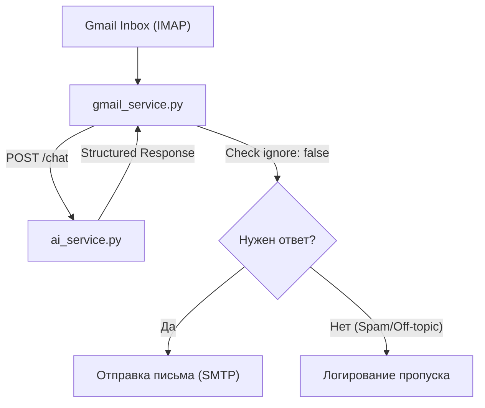

# Планирование интеграции Gmail Gate

Интеграция позволит Саиду обрабатывать входящие письма как полноценному менеджеру. Мы будем использовать существующий `ai_service` для «мозгов» и добавим новый коннектор для почты.

## 1. Конфигурация

В `.env` необходимо добавить параметры IMAP для чтения почты (сервер, порт, логин, пароль). Настройки SMTP у нас уже есть.

## 2. Создание Gmail сервиса

Создадим `gmail_service.py`, который будет работать по следующему циклу:

1. Подключение к Gmail через IMAP.
2. Поиск непрочитанных (UNSEEN) сообщений.
3. Для каждого письма:

    - Извлечение адреса отправителя, имени и текста.
    - Запрос к `ai_service` с метаданными `channel: email`.
    - Если ответ не помечен как `ignore`:
        - Отправка ответного письма через SMTP с подписью Саида.
    - Пометка письма как прочитанного.

## 3. Обновление управления

Добавим в `run.sh` флаг `--gmail` для отдельного запуска и включим его в `--all`.

## 4. Зависимости

Для удобной работы с почтой предлагаю добавить `imap_tools` в `pyproject.toml`, так как стандартная библиотека `imaplib` очень неудобна для парсинга современных писем.

## Важные файлы для изменения:

- `gmail_service.py` (создание)
- `run.sh` (обновление)
- `.env` (добавление параметров IMAP)
- `pyproject.toml` (добавление imap_tools)