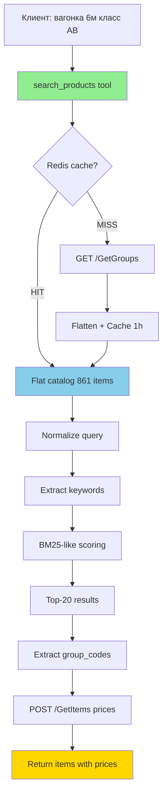
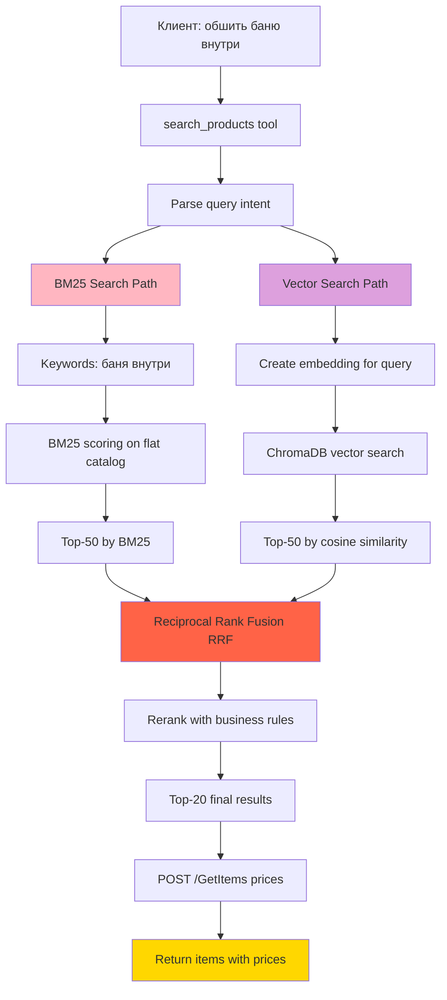
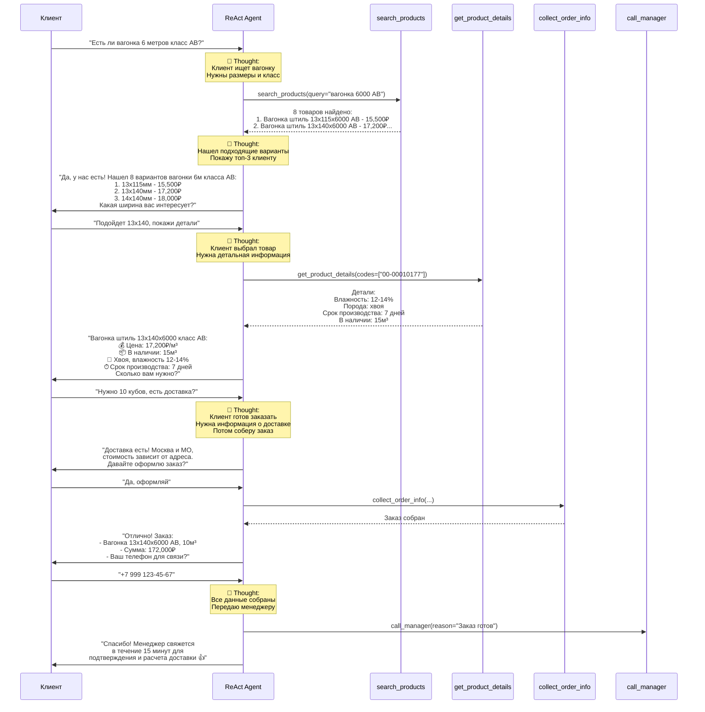
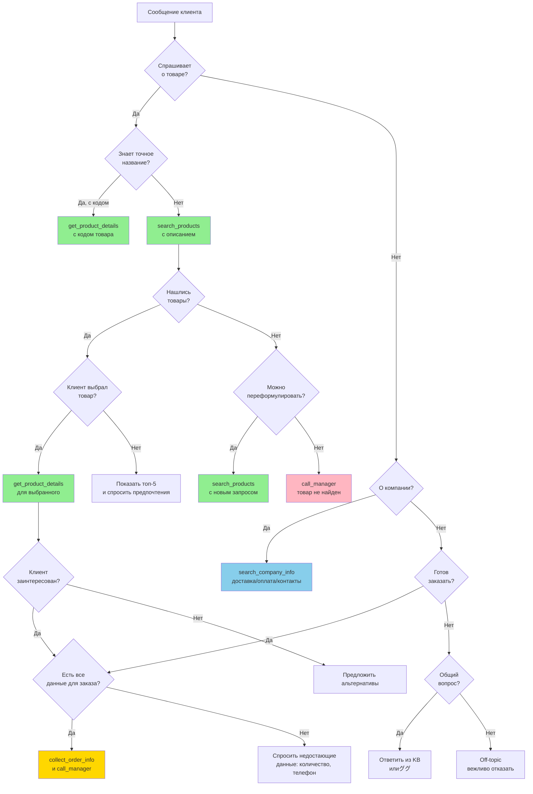
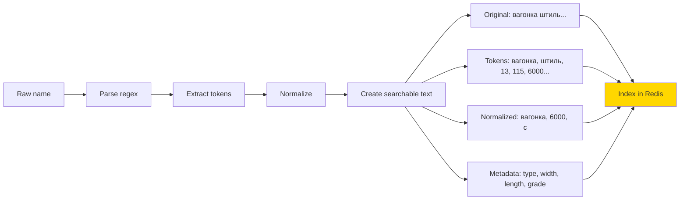

# Product Search Architecture - Полная система поиска товаров

## 📊 Исследование: Современные подходы к поиску в каталогах (2026)

### Гибридный поиск (Hybrid Search)

По данным [Elasticsearch Labs](https://www.elastic.co/search-labs/blog/hybrid-search-elasticsearch) и [исследований 2026 года](https://medium.com/@connect.hashblock/7-hybrid-search-recipes-bm25-vectors-without-lag-467189542bf0), **гибридный подход** является оптимальным для e-commerce каталогов:

```
Hybrid Search = BM25 (keyword) + Vector Search (semantic) + Reranking
```

**Почему это работает для e-commerce:**
- BM25 отлично находит **точные совпадения** ("вагонка 13х115х6000")
- Vector Search понимает **семантику** ("обшить баню" → липа/осина)
- Reranking (RRF) объединяет результаты без настройки весов

**Пример из практики** ([источник](https://www.elastic.co/search-labs/blog/hybrid-search-ecommerce)):
> "Nexlify Tech (5M пользователей, 10M товаров) снизили cart abandonment с 62% используя hybrid search. Pure BM25 пропускал синонимы ('sneakers' vs 'trainers'), vector-only игнорировал точные совпадения."

### Структурированные данные в 2026

[Google требует](https://developers.google.com/search/docs/specialty/ecommerce/include-structured-data-relevant-to-ecommerce) от e-commerce правильно размеченные структурированные данные:

> "If product data isn't structured for machines, it won't surface where shopping now begins — and that means lost revenue"

**Наши данные уже структурированы:**
```
"Вагонка штиль стр. сух. хв. 13х115х6000 класс С"
   ↓ parse ↓
{
  type: "вагонка штиль",
  treatment: "строганная",
  moisture: "сухая",
  species: "хвоя",
  dimensions: {width: 13, height: 115, length: 6000},
  grade: "С"
}
```

---

## 🎯 Наша архитектура поиска

### Phase 1: Keyword-based search (текущая реализация)



**Алгоритм scoring:**
```python
def score_item(item_name: str, keywords: List[str]) -> float:
    score = 0.0

    for kw in keywords:
        if exact_match(kw, item_name):      # целое слово
            score += 10
        elif partial_match(kw, item_name):  # подстрока
            score += 5

    if keywords_in_order(item_name, keywords):
        score += 3  # бонус за порядок слов

    # Краткие названия релевантнее
    score += (50 - len(item_name)) * 0.1

    return score
```

**Плюсы Phase 1:**
- ✅ Быстро (1-5ms in-memory)
- ✅ Дешево (без API calls для embeddings)
- ✅ Точно для размеров ("6000" exact match)
- ✅ Простая инфраструктура (только Redis)

**Минусы Phase 1:**
- ❌ Не понимает семантику ("баня" ≠ "липа")
- ❌ Не работает для синонимов (нужно добавлять вручную)
- ❌ Не учитывает опечатки

---

### Phase 2: Hybrid Search (будущее расширение)



**Reciprocal Rank Fusion (RRF):**
```python
def reciprocal_rank_fusion(bm25_results, vector_results, k=60):
    scores = defaultdict(float)

    for rank, item in enumerate(bm25_results, start=1):
        scores[item.id] += 1 / (k + rank)

    for rank, item in enumerate(vector_results, start=1):
        scores[item.id] += 1 / (k + rank)

    return sorted(scores.items(), key=lambda x: x[1], reverse=True)
```

**Когда переходить на Phase 2:**
- Каталог > 5,000 товаров
- Появились длинные описания товаров
- Нужен semantic search ("чем обшить баню?")
- Много синонимов и опечаток от клиентов

---

## 🤖 ReAct Agent Flow - Как думает агент



---

## 🧠 Decision Tree агента: Какой tool использовать?



---

## 📈 Алгоритм поиска: Deep Dive

### Структура названия товара

```
"Вагонка штиль стр. сух. хв. 13х115х6000 класс С"
   │        │      │    │    │     │      │      │
   │        │      │    │    │     │      │      └─ Класс качества
   │        │      │    │    │     │      └──────── Длина (мм)
   │        │      │    │    │     └─────────────── Ширина (мм)
   │        │      │    │    └───────────────────── Толщина (мм)
   │        │      │    └────────────────────────── Порода
   │        │      └─────────────────────────────── Влажность
   │        └────────────────────────────────────── Обработка
   └─────────────────────────────────────────────── Тип изделия
```

### Parse & Index Pipeline



### Query Processing Pipeline

```python
def process_query(query: str) -> SearchQuery:
    """
    "вагонка 6 метров класс АВ"
    →
    {
      original: "вагонка 6 метров класс АВ",
      normalized: "вагонка 6000 ав",
      keywords: ["вагонка", "6000", "ав"],
      filters: {
        type: "вагонка",
        length: 6000,
        grade: "АВ"
      },
      intent: "product_search"
    }
    """

    # 1. Нормализация
    normalized = normalize_query(query)  # "6м" → "6000"

    # 2. Извлечение keywords
    keywords = extract_keywords(normalized)

    # 3. Распознавание фильтров (если есть)
    filters = extract_filters(keywords)

    # 4. Классификация intent
    intent = classify_intent(query)

    return SearchQuery(
        original=query,
        normalized=normalized,
        keywords=keywords,
        filters=filters,
        intent=intent
    )
```

### Scoring Algorithm (BM25-like)

```python
def bm25_score(doc: Document, query_terms: List[str], k1=1.5, b=0.75) -> float:
    """
    BM25 = ∑ IDF(qi) * (f(qi, D) * (k1 + 1)) / (f(qi, D) + k1 * (1 - b + b * |D| / avgdl))

    где:
    - f(qi, D) = частота термина qi в документе D
    - |D| = длина документа D
    - avgdl = средняя длина документа в коллекции
    - IDF(qi) = log((N - n(qi) + 0.5) / (n(qi) + 0.5))
    """
    score = 0.0

    for term in query_terms:
        # Term frequency в документе
        tf = doc.count(term) / len(doc.tokens)

        # Inverse document frequency
        df = corpus.doc_count(term)  # сколько документов содержат term
        idf = math.log((corpus.total_docs - df + 0.5) / (df + 0.5))

        # Нормализация по длине документа
        norm = 1 - b + b * (len(doc.tokens) / corpus.avg_doc_length)

        # BM25 формула
        term_score = idf * (tf * (k1 + 1)) / (tf + k1 * norm)
        score += term_score

    return score
```

**Упрощенная версия (наша текущая):**
```python
def simple_score(item_name: str, keywords: List[str]) -> float:
    """Упрощенный BM25 без IDF расчетов (для малого каталога)."""
    score = 0.0

    for kw in keywords:
        # Exact match = высокий вес
        if f' {kw} ' in f' {item_name.lower()} ':
            score += 10
        # Partial match = средний вес
        elif kw in item_name.lower():
            score += 5

    # Бонусы
    if all(kw in item_name.lower() for kw in keywords):
        score += 3  # все keywords найдены

    # Penalty за длину (короткие названия лучше)
    score -= len(item_name) * 0.01

    return score
```

---

## 🚀 Roadmap развития поиска

### V1.0 - Keyword Search (ТЕКУЩАЯ)
- ✅ BM25-like scoring
- ✅ Нормализация запросов
- ✅ Кэширование в Redis
- ✅ Один tool вызов
- **Готовность**: 95%

### V1.1 - Enhanced Keyword Search
- [ ] Fuzzy matching (опечатки)
- [ ] Stemming (основа слова)
- [ ] Spell correction
- [ ] Query expansion (синонимы авто)
- **Срок**: 2 недели

### V2.0 - Hybrid Search
- [ ] Vector DB (ChromaDB)
- [ ] Embeddings для товаров
- [ ] Semantic search
- [ ] RRF fusion
- **Срок**: 1 месяц

### V2.1 - Personalization
- [ ] Учет истории поиска пользователя
- [ ] Популярные товары
- [ ] A/B тесты алгоритмов
- **Срок**: 2 месяца

---

## 📊 Метрики качества поиска

### Precision & Recall
```
Precision = relevant_found / total_found
Recall = relevant_found / total_relevant

F1 Score = 2 * (Precision * Recall) / (Precision + Recall)
```

### Mean Reciprocal Rank (MRR)
```
MRR = (1/|Q|) * ∑(1 / rank_i)

где rank_i = позиция первого релевантного результата
```

### Normalized Discounted Cumulative Gain (NDCG)
```
DCG@k = ∑(rel_i / log2(i + 1))

NDCG@k = DCG@k / IDCG@k
```

**Целевые метрики для V1.0:**
- Precision@5: > 80% (топ-5 релевантны)
- MRR: > 0.7 (первый релевантный в топ-3)
- Zero results rate: < 10% (не более 10% пустых ответов)

---

## 🔗 Sources

- [Elasticsearch Hybrid Search Guide](https://www.elastic.co/what-is/hybrid-search)
- [Semantic Product Search for E-Commerce (arXiv)](https://arxiv.org/abs/2008.08180)
- [Hybrid Search Recipes: BM25 + Vectors](https://medium.com/@connect.hashblock/7-hybrid-search-recipes-bm25-vectors-without-lag-467189542bf0)
- [Elasticsearch Labs: Hybrid Search for E-Commerce](https://www.elastic.co/search-labs/blog/hybrid-search-ecommerce)
- [Google Structured Data for E-Commerce](https://developers.google.com/search/docs/specialty/ecommerce/include-structured-data-relevant-to-ecommerce)
- [Optimizing RAG with Hybrid Search & Reranking](https://superlinked.com/vectorhub/articles/optimizing-rag-with-hybrid-search-reranking)

---

**Дата создания**: 2026-01-18
**Версия**: 1.0
**Статус**: Research Complete, Architecture Defined
